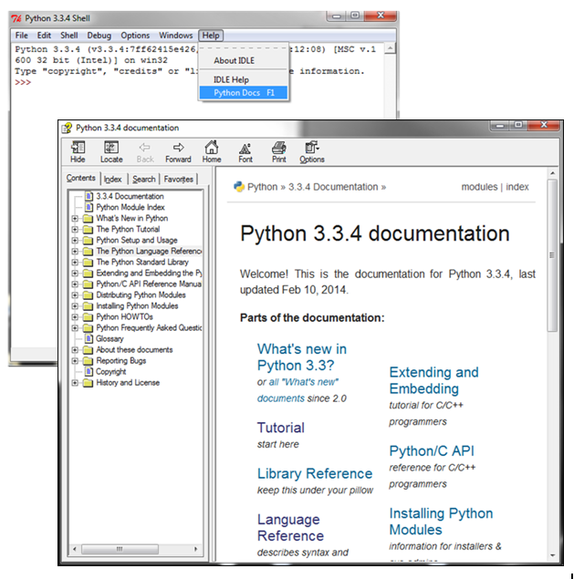
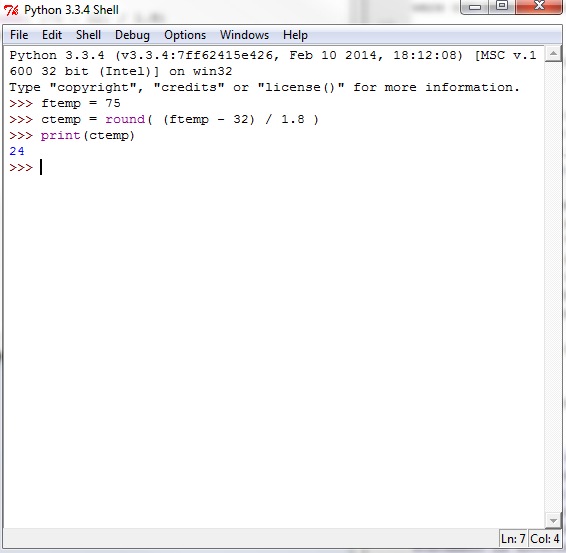
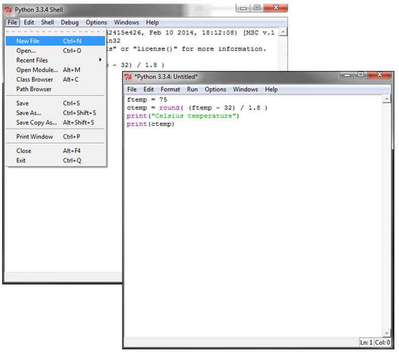
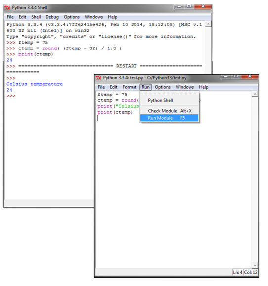
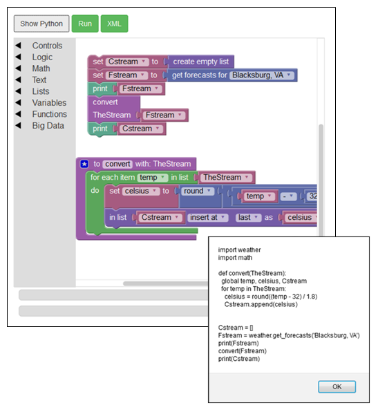
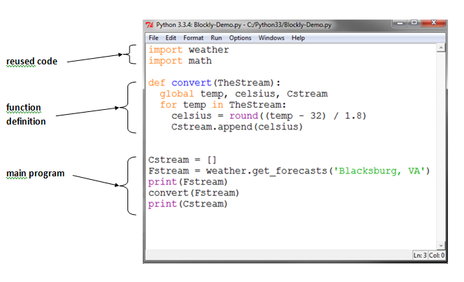
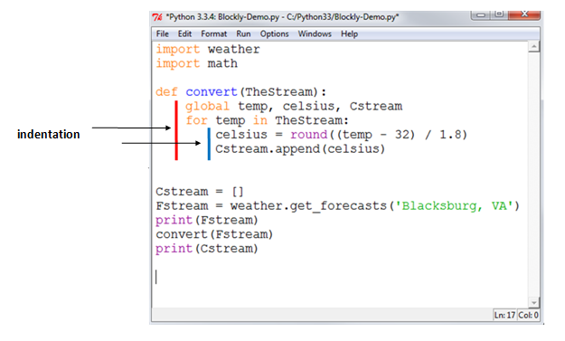
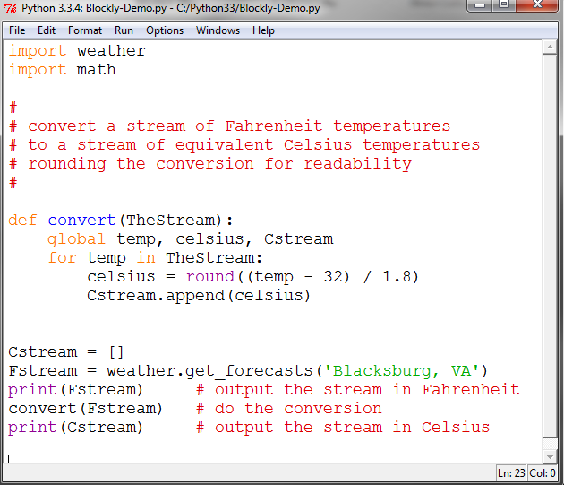

.. This file is part of the OpenDSA eTextbook project. See
.. http://algoviz.org/OpenDSA for more details.
.. Copyright (c) 2012-2013 by the OpenDSA Project Contributors, and
.. distributed under an MIT open source license.

.. avmetadata::
   :author: OpenDSA & CompThink Contributors
   :satisfies:
   :topic:

Getting Started with Python
===========================

To quickly build on the knowledge gained through the study of NetLogo and Blockly we will see

* how to use a Python programming environment to edit and run Python programs, and
* study the structure of a Python program using the Blockly examples.

The Python code generated for the Blockly examples will be cut and pasted into the programming environment for execution. This conversion of Blockly examples to executable Python programs will make for a smooth transition into the world of Python programming. In this Python world we will also see some new aspects of Python that were not seen in the Blockly examples.

A Python Programming Environment
--------------------------------

The `Python Software Foundation <https://www.python.org>`_ provides a freely available, multi-platform Python programming environment. You should `download <https://www.python.org/downloads/>`_ and install the latest Python 3 release for your computer. The class staff will help you with the download and installation. This software contains a Python Integrated DeveLopment Environment named IDLE.

Running the IDLE development environment produces the "Python Shell" window shown in the following figure. IDLE provides access to a great deal of information about Python. As shown in the figure, selecting the "Python Docs" entry in the "Help" menu brings up a window with links to extensive Python documentation. The most immediately useful documentation is the Python Tutorial. You can access this tutorial either under the "Tutorial" link in the main part of the documentation window or through "The Python Tutorial" folder in the menu on the left. You can use this tutorial to find details about language features that you already know (e.g., the syntax or meaning of a statement) as well discover new aspects of Python.

   Starting the Python Development Environment

The "Python Shell" window is the interface for a Python *interpreter* that can directly execute Python code. The three characters ">>>" is the shell prompt indicating that the interpreter is ready to be given Python code. The following figure shows that a small three line program has been entered. This program converts the Fahrenheit temperature of 75 to its rounded equivalent in Centigrade. As each line of code is entered the interpreter reads the line and performs the actions indicated by the code. The first two lines of code are calculations that the interpreter performs without any feedback. Immediately after the *print* statement is entered the interpreter performs the *print* statement and displays the value of the converted temperature.

   Directly Executing Code in the Shell

Directly entering code in the shell is useful for initial exploration of Python and testing very small programs. However, when the shell window is closed any code that was entered is lost. Also, it is difficulty to edit the code you are entering.

For practical programming the shell window is used to open an edit window by selecting the *New File* entry in the *File* menu. The edit window provides a basic editor for Python programs. The Python code in this window can be cut, pasted, moved, searched, etc. until the code is as desired. You can see in the figure below that the program created in the edit window is the temperature conversion with an additional print statement added to label the output as "Celsius temperature".

Notice that the edit window as the word "Untitled" in the window's name. This reflects the fact that the code entered in the window has not yet been saved to a file. To save the file use the *Save As ...* option in the File menu of the edit window. The *Save As* dialog will ask you to choose a name for the file. You will notice that the word "Untitled" will be changed to the name of the file you chose and its location in the file system. In this case the file was saved as "test.py". The ".py" suffix denotes a file containing Python code.

   Creating Code in the Edit Window

It is important to recognize a significant difference between the shell window and the edit window. The shell window is the interface to the Python interpreter which can execute Python code. The edit window is the interface to the Python code editor. While the editor can help you create code it cannot execute that code.

The  Python interpreter and the Python code editor work together. Once you have edited and saved the Python code you can use the *Run Module* menu in the *Run* menu of the edit window to execute the code saved in the file that is shown in the edit window. This is shown in the following figure. If you forget to save the file before attempting to execute the code the editor window will prompt you to do so.

   Executing Edited Code

Notice that the interpreter has drawn a *RESTART* line across the shell window and executed the code in test.py. The interpreter performs the calculations and directs the output from the two print statements to the shell window. You can see these two lines of output in the shell window.

We now have the tools to create and revise large Python programs using the Python code editor and we can execute these programs using the Python interpreter.

The Blockly programs developed earlier used many of the common programming structures that are found in Python for calculation, sequence, decisions, and iterations. We can use the ability of Blockly to translate these Blockly programs into Python as an expedient way of learning the syntax of Python.

The following figure shows the example in the section *Functions with Parameters* when the "Show Python" button was pushed. Note: the code display has been slightly moved in the figure to allow both the Blockly version and the Python version to be seen side by side. In a similar way the Python code for any Blockly program can be viewed.

    Translating Blockly to Python

The Python code for a Blockly program can be copied and pasted into an IDLE editor window as shown in the following figure. AFter pasting the code the editor file was saved as *Blockly-Demo.py* and then executed. You can see the output in the shell window resulting from this execution. Verify that this is the same output as produced by the Blockly version.

 .. figure:: Python-Executing-Blockly-Code.png
    :align:  center

    Executing the Python Code from the Blockly Version

The important point of this demonstration is that the Python code generate by Blockly is a complete and valid   Python program that can be directly executed by the Python interpreter.  We can now edit the code with the Python editor and create variations of this code.

Exercise. Edit the example to change the string "Blacksburg, VA" to "Miami, FL" and run the Python code. Be careful that you spell the string correctly and that there is exactly one space between the comma and the capital letter "F".

The Anatomy of a Python Program
-------------------------------

The Python code generated by the Blockly example will be used to examine some of the important aspects of a Python program.

Overall Structure
^^^^^^^^^^^^^^^^^

The following figure shows the code for the example with three regions identified. We will return soon to examine the detailed syntax of the individual statements. For now we want to get a "big picture" view.

    Parts of a Python Program

The topmost part of the example code is a pair of *import* statements. Each *import* statement identifies a Python module that contains code to be reused in this program. The first statement identifies a module named *weather* and the second statement identifies a module named *math*. The *weather* module contains the code for the function *get_forecasts* that is used in the main program. The *weather* module also contains other functions that are part of the weather data stream. The *math* module contains the code for the *round* operation that is used in the *convert* function. The *math* module also contains many other mathematical operations (square root, trigonometric operations, logarithms, etc.).

The *import* statements are important because no serious Python program is written without reusing some code. In fact, most applications reuse code extensively. Not only does code reuse lower the cost of developing new applications but the reused code is also likely to have been tested and have had programming errors removed by previous uses. The Python developer community has made available a large number of modules some of which we will use later for data visualization.

The middle part of the example code is the definition of the *convert* function. The general sense of this code should be apparent though we will return shortly to examine the details syntax of these statements. It is often the case that a realistic program will contain many such function definitions.

The bottom part of the example code is the *main* program. Each Python program has one *main* program. This is the code where the execution of the program begins. When this code has been fully executed the program ends its execution.

Indentation
^^^^^^^^^^^

Another general characteristic of Python programs the importance of how the lines of code are indented. Python uses indentation to answer a question that all textual programming languages have to answer. In Python, the beginning of a function definition is clearly indicated by the *def* keyword and the beginning of the iteration by the *for* keyword. However, where is the end of the body of the code for the iteration? and where is the end of the body of the code for the function? Different languages answer this question in different ways. We saw that NetLogo used a keyword *end* to indicate the end of the function definition and square brackets to delimit the code in the body of an iteration. Blockly answers these questions by the shape of the blocks. All of the code in the body of an iteration is in the slot for the iteration block and all of the code in a function definition is in the slot for the function definition block. Python uses indentation to answer this question.

In the following figure the indentation of the example code has been increased slightly for illustration purposes. Two vertical lines, one red and one blue, are used in the figure to identify where indentation has been used. You can see that every line that is part of the body of the function definition is indented as least four spaces and every line that is part of the body of the iteration is indented at least four additional (a total of eight) spaces. It is common practice to use four additional spaces at each new level of indentation.

    Indenting Lines of Code

Care is needed because spaces added by using the "Tab" key may be different than a sequence of spaces. While they may look the same to you they are different to the Python interpreter. Four spaces is four characters while one tab is only one character. Welcome to the world of computing where details do matter.

Comments
^^^^^^^^

Understanding what (especially complex) code does is difficult so documenting what the code is intended to do is a sign of good craftsmanship. Each programming language has some means of including *comments* in the program text. These comments provide a way for the code's author to convey to a human reader important information about the code. The meaning, purpose, or design are often documented in this way. Comments are written by a human for a human and are skipped over by the Python interpreter. The following figure shows our example code with comments added.

    Commenting Python Code

Python comments begin with a "#" (pound sign or hash symbol) and extend to the end of the line. As shown in the figure above comments can occupy either an entire line or only part of line. The sequence of comments preceding the function definition each occupy the entire line. Such sequences are often used when there is a lot to say about something. Remember that these (and all) comments are skipped over by the interpreter. The three individual comments in the main program each occupy only part of a line. Each individual comment is meant to explain what the code on that line does. Comments like this are used when there is only a brief clarification that is needed.

Finally, there is nothing that guarantees that the comments are "correct" or "meaningful" in any way. The comments for the function definition may say that the conversion is from Fahrenheit to Kelvin.  The interpreter, however, ignores the comments and does what the code says to do, namely, do the calculations that convert from Fahrenheit to Kelvin. The programmer is entirely responsible for ensuring that the comments are meaningful.

Exercise. Take the Blockly example in the section *Functions with Return Values* and execute it as a Python program.

Exercise. Take the Blockly example in the section *Basic Functions* and execute it as a Python program.