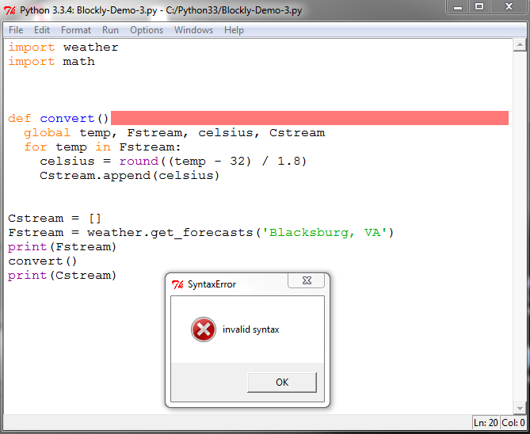

Python Syntax
=============

To be literate in any language you need to know the language's syntax, the rules that define what are correctly structured expressions in the language. The syntax for Python defines how its expressions are correctly structured. The Python interpreter can only execute those statements that are correct according to the syntax rules of the Python language. Here we will learn the syntax for the parts of the Python language that we are using.

You can check the syntax of your code using the IDLE editor. To illustrate syntax checking a syntax error has been deliberately introduced into the code of one of the examples as shown in the following figure. The syntax error is in the line that now reads *def convert()* and should read *def convert():*. Note that the colon (":") is missing in the incorrect version shown in the figure. The absence of the colon at the end of this line is a syntax mistake. To check the syntax of the code select from the *Run* menu the *Check Module* entry as shown in the figure. If there are no syntax errors the editor makes no visible actions (its silence is consent that the code is syntactically correct).

.. figure:: ../Images/Python-IDLE-Syntax-Checking.png
   :align: center

   Checking the Syntax of Your Code

The IDLE reports syntax errors as shown in the following figure. When a syntax error is discovered two visible actions occur. First, a *SyntaxError* window pop-up containing the phrase *invalid syntax*. Second, the place in the editor window where the error is detected is highlighted as shown in the figure: the empty space at the end of the line containing the error is changed to a bright color. To fix the problem you need to dismiss the pop-up window by clicking its *OK* button and then editing the code itself to correct the syntax.

   Reporting Syntax Errors

The editor will report only the first syntax error that it has found. If the code contains several syntax errors the syntax checking will have to be repeated once for each error. It is a good habit to periodically check the syntax of the code you are writing.

You can get additional help with the Python syntax by looking at explanation and examples in the `Python Tutorial <https://docs.python.org/3/tutorial/>`_. The definitive though harder to read source of help is the `Python Language Reference <https://docs.python.org/3/reference/index.html>`_. These documents can also be accessed from the IDLE editor window: in the *Help* menu select the *Python Docs* entry. There are also many other web tutorials and examples that you can find via a web search.

Beyond their syntax languages also have a semantic aspect. Semantics refers to the meaning of what is expressed in the language. It is possible, of course, to make syntactically correct statements that are semantically meaningless. To say in English that "The sky is triangular." is syntactically correct but it meaningless (outside of avant garde poetry or drug inspired rock songs).

Programs may also be syntactically correct by semantically wrong. For example, the correct way to convert a Temperature, T, from Fahrenheit to Celsius uses the formula *(T-32)/1.8*. If instead we write a program that uses the formula *(32-T)/8.1* we will have a program that is syntactically correct but is not meaningful - it does not produce the output that corresponds to the meaning of a Celsius temperature in the real world. A program may be so semantically damaged that the Python interpreter cannot execute it. For example, in this code:

.. code:
   factor = 0;
   ...
   result = (T - 32) / factor

the interpreter is asked to perform a calculation of dividing by zero, an operation which has no mathematical meaning. In this case, the interpreter will abort the execution and report a *run time* error. Finding and fixing errors that occur at run time, called *debugging*, is often a tedious and difficult task.

Exercise. Deliberately make different syntax errors in one of the code examples and try the above steps.

Calculation
-----------

Calculations for data streams usually involve working with *numbers* or *characters*. Some numbers may be whole number, either positive or negative, such as -10, 512, 32, 0. Numbers like these are often called "integers" in programming languages. Other numbers may be rational numbers with a decimal point, either positive or negative, such as 2.1415, 1.8, -267.52. Numbers like these are often called "floating point" numbers in programming languages. For the moment we will treat all of these under the term *numbers*.

Programs also use and manipulate non-numeric values. We have seen in earlier examples values like "Blacksburg,VA" to name a location and "hot" to describe a temperature range. Such data, consisting of a sequence of characters, is often called a "character string", or simply a "string".

The syntax for statements that manipulate number and characters is examined below. This review provides basic but incomplete descriptions. It is enough to get started, but you will need to explore other sources (like the `Python Tutorial <https://docs.python.org/3/tutorial/>`_ or similar materials) to extend your knowledge.

With Numbers
^^^^^^^^^^^^

Numeric calculations are usually done to initialize, change, or update the value of some property. The value of the calculation is assigned as the new value of the property. These properties are "variable properties" because their value can change. Instead of "variable properties" the term "variable" is often used as a shorthand. As we have seen, an example of the temperature conversion calculation in Python is

..  code::

    ftemp = 77
    celsius = (ftemp - 32)/1.8

The result of this calculation, that is the value assigned to the variable *celsius*, is 25.0.

Calculations are largely straightforward but there are some dangers. A deceptively incorrect way to write the temperature conversion calculation is:

..  code::

    ftemp = 77
    celsius = ftemp-32 / 1.8

In Python the value assigned to the variable *celsius* in this case is (approximately) 59.2. There is clearly a big difference between these two calculations.

The difference in the two calculations above is that in Python (as in most programming languages) there is a defined order in which the steps of a calculation are carried out. Each step in the calculation involves picking a mathematical operator and performing that operation on its operands. In each example above there is a choice between performing the subtraction step first or the division step first. In Python, each mathematical operator is giving a ranking, or "precedence" in the defined order. The list of numeric operators and their precedence is as follows:

+--------------+----------------------------------------+
|   operator   |             meaning                    |
+==============+========================================+
|      ()      |   parenthesis, grouping                |
+--------------+----------------------------------------+
|     \*\*     |   exponentiation (raising to a power)  |
+--------------+----------------------------------------+
|    +x, -x    |   positive number, negative number     |
+--------------+----------------------------------------+
|  \*, /, %    |   multiplication, division, remainder  |
+--------------+----------------------------------------+
|     +, -     |   addition, subtraction                |
+--------------+----------------------------------------+

where the parenthesis for grouping is the highest precedence while both addition and subtraction are the lowest precedence.

In the first example the parenthesis in the part *(ftemp - 32)* led to the subtraction being performed first. The steps in the first example are:

.. code::

   1. select the subtraction operator and compute the result of 77 - 32 which is 45
   2. select the division operator and compute the result of 45/1.8 which is 25.0

In the second example the choice was made to perform the division step first because, without the parenthesis, the "precedence" of the division operator is higher than that of the the subtraction operation. The steps in the second example are:

.. code::

   1. select the division operator and compute the result of 32/1.8 which is (approximately) 17.7
   2. select the addition operator and compute the result of 77 - 17.7 which is (approximately) 59.2

If you are not sure whether a calculation is written correctly you can always:

* test it. Use Python's interactive ability to try the calculation and see if it is giving the expected results.
* add parenthesis. You can always be sure of the order of the steps in a calculation by adding parenthesis since this has the highest precedence.
* rewrite it. Break a single assignment down into several assignments where the steps in each assignment are clear. For example, the temperature conversion could be written as:

.. code::

   ftemp = 76
   num = ftemp - 32
   celsius = num/1.8

With Characters
^^^^^^^^^^^^^^^

Strings of characters are natural ways to represent texts ("To be or not to be"), persons ("John Doe"), locations ("Blacksburg, VA"), events ("Norman Invasion"), conditions ("hot"), stocks ("MS"), genes sequences ("AACGTTTAACC"), and many more. Many of the big data streams will have some form of character data included.

String of characters that look like numbers are not numbers. The character string "256" and the number 256 are very different (at least to a computer). The first is a character string and the second is a number. In general, operations that apply to one cannot be applied to the other. For example, it is not meaningful to write *"256" - 50* because the character string "256" is not a number.

A Python string is a sequence of characters. Each character in the string has a position or index. The index of the first character is 0 (zero), the index of the second character is 1, and so on. If a string has *n* characters the index of the last character in the string is *n-1*. Blanks and spaces are characters even though they are not visible.

The code below shows some of the basics of working with strings. The built in *len* function returns the number of characters in the string. Individual characters can be accessed by their positions. For example, *text[0]* refers to the character in the first position. A slice is a consecutive sequence of characters. In this example *text[0:10]* refers to the 11 (eleven) consecutive characters beginning with the first character. If the first index in a slice is missing it is assumed to be the first character and if the second index in a slice is missing it is assumed to be the last character.

..  activecode:: string-example1

    text = "To be or not to be. That is the question."
    print(text)
    length = len(text)
    print("has",length, "characters")

    print(text[0])            # individual characters
    print(text[1])

    slice1 = text[0:10]       # a string slice
    slice2 = text[10:20]
    print(slice1)
    print(slice2)

    slice3 = text[:15]        # same as text[0:10]
    slice4 = text[35:]        # from 35 to the end
    print(slice3)
    print(slice4)

Strings can be broken apart and combined. The first part of the example breaks a string in half. Note that integer division ("//") is used to be sure that the division results in a value that can be used as an index (i.e., an integer). The second part of the example below combines two slices to form an ellipsis of the entire text. Notice that the plus sign ("+") when applied to strings can be used to concatenate strings together.

..  activecode:: string-example2

    text = "To be or not to be. That is the question."
    print(text)

    middle = len(text) // 2    # finding the middle using integer division

    start = text[0:middle]     # first half of string
    rest = text[middle:]       # second half of string
    print(start)
    print(rest)

    slice3 = text[:10]
    slice4 = text[35:]
    join = slice3 + "..." + slice4     # combining strings
    print(join)

Python provides a wide variety of ways to search and edit character strings. The operator *in* searches for a word contained in the string and yields *True* if the word is present and *False* otherwise. The *count* method finds how many times a word occurs in the string. The *replace* method produces a new string where the occurrences of one word is replaces with another word. Finally, the *find* method returns the index of where a specified word in the text begins.

..  activecode:: string-example3

    text = "To be or not to be. That is the question."
    print(text)

    if "not" in text:                       # search text of an occurrence
        print("contains the word 'not'")

    number = text.count("be")               # search text for number of occurrences
    print("contains the word 'be'", number, "times")

    where = text.find("not")
    print("The word 'not' starts at", where)

    new_text = text.replace("be", "exist")  # change word with another word
    print(new_text)

The details for these operations and a complete list of the built-in string methods can be found in the `Python Documentation <https://docs.python.org/3/library/stdtypes.html#string-methods>`_.

Decisions
---------

*If* Statements
^^^^^^^^^^^^^^^

We have seen in NetLogo and Blockly how programs can make decisions to guide the actions of the program. The decision statements in Python come in three "flavors" which are illustrated by the following examples that categorize a temperature according to this table:

+-----------------+----------+-------------+
|    Category     |  Above   |   At/Below  |
+-----------------+----------+-------------+
|     Hot         |    90    |             |
+-----------------+----------+-------------+
|     Warm        |    76    |     90      |
+-----------------+----------+-------------+
|     Cool        |    50    |     76      |
+-----------------+----------+-------------+
|     Cold        |    32    |     50      |
+-----------------+----------+-------------+
|    Frigid       |          |     32      |
+-----------------+----------+-------------+

According to this classification a temperature of 95 degrees would be "Hot", 90 degrees would be "Warm", 75  degrees would be "Cool" and 32 degrees would be "Cold".

The indentation of code that was described earlier is a vital part of the Python syntax for decision statements. Recall that a standard practice in Python is to use four (4) spaces at each level of indentation.

In the first example we simply want to decide if a given temperature is classified as "Hot". The flowchart form of the logic that is needed is shown in the following figure.

..  figure:: RST/Images/Python-If-Then-Flowchart.png
    :align:  center

    The Flowchart for Classifying "Hot" Temperatures

Here is the corresponding Python code:

.. activecode::  if-then-example

     temp = 80                # try changing the value of temp
                              # to get the output of "Hot"
     category = "Other"
     if temp > 90 :
         category = "Hot"
     print(category)

There are three things to notice about the syntax of this code. They are:

* there is a colon ":" at the end of the *if* statement.
* the statements that are to be executed when the condition is true are indented four more spaces than the *if* statement itself; in this case there is only one statement to be indented but, if there more, all of them must be similarly indented.
* the statement that follow the *if* statement are indented at the same level as the *if* statement itself; notice that the *print* and *if* statements are at the same level of indentation.

In the second example we want to decide if a given temperature is either "Hot" or "Frigid". The flowchart form of the logic that is needed is shown in the following figure.

..  figure:: RST/Images/Python-If-Then-Else-Flowchart.png
    :align:  center

    The Flowchart for Classifying "Hot" and "Frigid" Temperatures

Here is the code for this case:

.. activecode:: if-then-else-example

     temp = 72               # try changing the value of temp to get
                             # each of the three possible outputs
     category = "Other"
     if temp > 90 :          # first decision
         category = "Hot"
     else:
         if temp <= 32:      # second decision
            category = "Cold"

     print(category)

The important things to notice about the syntax of this example are:

* both *if* statements are ended by a colon (":")
* the keyword *else* begins the alternative to the first *if* and is also ended by a colon (":")
* the code for the *else* alternative is indented four more spaces than the *else* itself; it is indented at the same level as the code executed when the first decision is true; the indentation of the *else* code shows that it is to be executed only as an alternative to the first decision
* the code to be executed when the second decision is true is indented four spaces more than the *if* statement itself.

In the third example we want to decide if a given temperature is either "Hot", "Warm", "Cool" or "Other". The flowchart form of the logic that is needed is shown in the following figure.

..  figure:: RST/Images/Python-If-Else-If-Flowchart.png
    :align:  center

    The Flowchart for Classifying "Hot", "Warm", "Cool" and "Other" Temperatures

Here is the code for this case:

.. activecode:: if-elif-example

     temp = 72             # try changing the value of temp to get
                           # each of the four possible outputs

     if temp > 90 :
         category = "Hot"
     elif temp > 76:
         category = "Warm"
     elif temp > 50 :
         category = "Cool"
     else:
         category = "Other"

     print(category)

The important things to notice about the syntax of this example are:

* the *elif* keyword is a contraction of *else if*
* all *if*, *elif* and *else* lines are ended by a colon (":")
* the code to be executed for each decision is indented four more spaces that the decision itself

Conditions
^^^^^^^^^^

The conditions used in *if* statements can involve a variety of individual tests and the individual tests can be combined to form complex conditions. Individual tests  involve a comparison (or relational) operator. We have seen earlier individual test such as *temp > 90* using the *greater than* operator. An individual test is either *true* or *false*. The comparison operators and their meaning are shown in the following table.

+------------+---------------------------+--------------+--------------------------------------------+
| Operator   |       Name                |    Example   |   True if (and false otherwise)            |
+------------+---------------------------+--------------+--------------------------------------------+
|    ==      |  equality                 |  temp == 90  |  temp is equal to 90                       |
+------------+---------------------------+--------------+--------------------------------------------+
|    !=      |  inequality               |  temp != 90  |  temp is not equal to 90                   |
+------------+---------------------------+--------------+--------------------------------------------+
|    >       |  greater than             |  temp  > 90  |  temp is greater than 90                   |
+------------+---------------------------+--------------+--------------------------------------------+
|    <       |  less than                |  temp  < 90  |  temp is less than 90                      |
+------------+---------------------------+--------------+--------------------------------------------+
|    >=      |  greater than or equal to |  temp >= 90  |  temp is greater than 90 or is equal to 90 |
+------------+---------------------------+--------------+--------------------------------------------+
|    <=      |  less than or equal to    |  temp <= 90  |  temp is less than 90 or is equal to 90    |
+------------+---------------------------+--------------+--------------------------------------------+

Logical (or Boolean) operators are used to combine individual tests into more complex tests. The logical (or Boolean) operators combine *true* and *false* values and result in a *true* or *false* value. The logical operators and their meaning are shown in the following table.

+-----------+--------------------------------+--------------+------------------------------+
| Operator  |        Example                 |   True if (and false otherwise)             |
+-----------+--------------------------------+--------------+------------------------------+
|   and     |  (temp < 90) and  (temp >= 76) |  both (temp <90) and (temp >= 76) are true  |
+-----------+--------------------------------+--------------+------------------------------+
|   or      |  (temp > 90) or (temp <= 32)   |  at least one of (temp > 90)                |
|           |                                |  or (temp <= 32) is true                    |
+-----------+--------------------------------+--------------+------------------------------+
|   not     |  not (temp  > 90)              |  it is not the case that (temp > 90)        |
+-----------+--------------------------------+--------------+------------------------------+

As an example, if we wanted to test for a temperature being either "Warm" or "Cold" we could use this code:

.. activecode::  and-example

     temp = 82             # try changing the value of temp to get
                           # each of the two possible outputs
     category = "Other"

     if (temp <= 90) and (temp > 76):
         category = "Warm"
     elif (temp <= 50) and (temp > 32):
         category = "Cold"
     print(category)

Alternatively, if we wanted to describes "Extreme" temperatures as those that are at either end of our temperature classification we could use this code:

.. activecode:: or-example

     temp = 92                       # try changing the value of temp to get
                                     # each of the two possible outputs
     category = "Other"

     if (temp > 90) or (temp <= 32):
         category = "Extreme"
     print(category)

Finally, if we classified temperatures as "Seasonable" if it was not an extreme temperature we could use this code:

.. activecode::  not-example

     temp = 82                      # try changing the value of temp to get
                                    # each of the two possible outputs
     category = "Other"

     if not ((temp > 90) or (temp <= 32)):
         category = "Seasonable"
     print(category)

Notice that an extra set of parenthesis is used to insure that the *or* operation is performed first.

Lists and Iteration
-------------------

Because lists and iteration are often used together to store and process big data streams we will look at the syntax of these two elements together. A Python list is an ordered sequence of elements. Ordered means that the list has a first element, a second, element, and so on. Because the list is finite it also has a last element and a length. The order of the elements in the list is determined by the application, not by Python. There are many reasonable ways for an application to organize its data in a list. For example, the list of temperatures representing the forecast for a particular city might be time ordered: the first element of the list being the forecast for tomorrow, the second element being the forecast for the day after tomorrow, and so on. The list of names of people in an organization might be ordered alphabetically.

Complete Iteration
^^^^^^^^^^^^^^^^^^

The basic operations on lists and iterating through all of the list elements is shown in the following code. In this code a list is created by stating with an empty list and adding elements to it. The list is printed after each step so that the effect of each operation can be seen. Finally, iteration is used to access and print each element of the list. Run the following code.

.. activecode:: list-example1

   items = []               # make an empty list
   print(items)

   items = items + [6]      # append a single element to items
   print(items)

   items = items + [7]      # append a single element items
   print(items)

   items = items + [1,4,3]  # append a list to items
   print(items)

   print("Iterating through entire list")

   for it in items:         # for each element in the list items ...
       print(it)

Syntactically, a list is zero or more elements surrounded by square brackets. Adjacent elements in the list are separated by commas. There is no comma after the last element of the list. Elements can be appended to the end of the list by two different means. The plus sign (*+*) when applied to lists is one way.

An alternative way building the same list as shown above is illustrated by the following code which uses a "method" feature of Python.

.. activecode:: list-example2

   items = []               # make an empty list
   print(items)

   items.append(6)          # add a single element to the end of items
   print(items)

   items.append(7)          # add a single element to the end of items
   print(items)

   items.extend([1,4,3,4])  # add a list to the end of items
   print(items)

   print("Iterating through entire list")

   for it in items:         # for each element in the list items ...
       print(it)

   items.remove(4)          # remove the first occurrence of item with value 4

   print("List with item removed")

   for it in items:         # print modified list
       print(it)

This code uses the operations *append* and *extend* to add a single element or a list of elements, respectively. These two operations are called "methods" in Python. In each case the new elements are added to the end of the list. Note the required period or dot (".") that separates the name of the list from the operation to be applied to the list. Items can be deleted from a list using the *remove* method. In this example, the first occurrence of the item *4* is removed from the list.

Edit and run the above code to add and remove other elements.

In the two examples above iteration was used to operate on each element of the list. The elements are selected in order. Thus, the fist iteration operates on the first element of the list, the second iteration operates on the second element of the list, and so on. On each iteration the name *it* represents the element of the list currently being operated on.

Some important things to notice about the syntax of this form of iteration are:

* the keywords *for* and *in* must appear as shown in the examples
* the *for* statement is ended by a colon (":")
* the statements that are part of the body of the iteration (i.e., executed on each iteration) must be indented
* the statement to be executed after the iteration has completed is indented at the same level as the *for* statement (see the *print("done")* statement in the examples above)

Range Iteration
^^^^^^^^^^^^^^^

Because lists are ordered it is possible to refer to each element by its position and iterate over only selected elements of the list. In Python (and in a number of other programming languages) the first element of the list is said to be at position 0 (zero), the second element of the list is said to be at position 1, and so on. In the following example, the element in position 0 is 85, the element in position 1 is 60, and the element in position 4 is 77. In this example the list list contains a sequence of high and low temperatures predicted for a given city. Thus, as shown, the high temperature for tomorrow is 85 and the low temperature for tomorrow is 60. The day after tomorrow has a high and low of 87 and 62, respectively, The list *forecast* shows four days with the high and low temperatures.

.. activecode:: list-example3

   forecast = [85, 60, 87, 62, 77, 55, 75, 40]  # high and low temperatures for each day

   # access list elements by their positions

   day1_high = forecast[0]
   day1_low  = forecast[1]
   day4_high = forecast[6]
   day4_low  = forecast[7]

   print(day1_high, day1_low, day4_high, day4_low)

The syntax for accessing a list element by its position is to put the position in square brackets after the name of the list. In this example, *forecast[0]* refers to the first element in the list (remember the positions are numbered beginning at 0 (zero)) and *forecast[6]* refers to the list element in the 7th position. Edit the code above to select other positions in the list and confirm your understanding.

Python has a *range* feature that helps in iterating over all or only some of the elements in a list. The *range* specifies the positions that are used in each iteration. The *range* feature generates a pattern of positions as shown in the following example.

.. activecode:: range-examples

    print("range(5) is")
    for p in range(5):
        print(p)

    print("range(10) is")
    for p in range(10):
        print(p)

    print("range(3,12) is")
    for p in range(3,12):
        print(p)

    print("range(3,12,2) is")
    for p in range(3,12,2):
        print(p)

The various form of *range* have these meanings:

*  *range(n)* denotes the positions *0, 1,...,n-1*. This form is useful to iterate over a consecutive set of positions starting at the beginning of the list.
*  *range(m,n) denotes the positions *m, m+1,...,n-1*. This form is useful to iterative over a consecutive set of positions starting at the *mth* position
*  *range(m,n,k) denotes the positions *m, m+k, m+2k,..., n-1*. This form is useful to iterate over a set of non-consecutive elements that are *k* positions apart from each other.

Try experimenting with the above code to confirm your understanding of the *range* feature.

The forms of the *range* feature can be used in our forecast list as shown in the next example which shows three iterations. In the first iteration, *range(8)* denotes all of the eight positions in the list. In the second example, *range(0,7,2)* denotes every other position beginning with the first position - these are the positions where the high temperatures are located. In the third example, *range(1,8,2)* denotes every other position beginning with the second position - these are the positions where the low temperatures are located.

..  activecode:: range-iteration1

   # high and low temperatures for each day
   forecast = [85, 60, 87, 62, 77, 55, 75, 40]

   # print all temperatures: at positions 0,1,2,3,4,5,6,7

   print("all temperatures")
   for p in range(8):
       print(forecast[p])

   #print only high temperatures: at positions 0,2,4, and 6

   print("high temperatures")
   for p in range(0, 7, 2):
       print(forecast[p])

   #print only low temperatures: at positions 1,3,5,7

   print("low temperatures")
   for p in range(1, 8, 2):
       print(forecast[p])

In many cases we do not know the exact length of the list in advance. Python provides a *len(list)* function which returns the length of the list. The range iteration examples above can be redone using the *len* function as shown here.

..  activecode:: range-iteration-len

   # high and low temperatures for each day
   forecast = [85, 60, 87, 62, 77, 55, 75, 40]

   # print all temperatures: at positions 0,1,2,3,4,5,6,7

   print("all temperatures")
   for p in range(len(forecast)):
       print(forecast[p])

   #print only high temperatures: at positions 0,2,4, and 6

   print("high temperatures")
   for p in range(0, len(forecast)-1, 2):
       print(forecast[p])

   #print only low temperatures: at positions 1,3,5,7

   print("low temperatures")
   for p in range(1, len(forecast), 2):
       print(forecast[p])

Try adding additional days to the high-low forecast list in the preceding example and see that the code works for any length of list.

It is also possible to change the contents of the lists by adding or removing elements at specific positions. We have already seen the *append*, *extend*, and *remove* methods used above. Other methods that provide list manipulation by position are shown next.

.. code::

   list.insert(i,x)  inserts the item x at position i
                     elements prior to position i are unchanged
                     elements previously at position i or higher are now at one position greater

   list.index(x)     returns the index of the first element in the list whose value is x

Convenience operations are also available for commonly used operations. The Python documentation has a complete list of the methods that can be used with lists.

Searching with Iteration
^^^^^^^^^^^^^^^^^^^^^^^^

An important use of iteration is to search a data stream looking for an item that match some criterion. Ideally the iteration should be controlled so that:

* once the item matching the criteria has been found we need not continue looking, and
* what to do if we did not find an item matching the criterion.

For example, suppose that we were searching a list of temperatures to find the first temperature that matches some criterion (e.g, less than a certain temperature). Once we have found a temperature that matches the criterion we need not look further. On the other hand no such temperature might be present in the data stream.

Python helps us to build a search iteration as shown in here.

..  activecode:: search-iteration

    forecast = [85, 60, 87, 62, 77, 55, 75, 40]

    for temp in forecast:
        if (temp < 60):
            print("Low temperature found: ", temp)
            break

    else:
        print("No low temperature found.")

The *break* statement causes the iteration in which it is contained to immediately end. The *else:* clause for the iteration is used only when the iteration reaches the end with out an early termination. In no case will both *print* statements be executed.

Edit the above code to try different temperature values of the criterion and observe the effect.

Dictionaries
------------

Structure and Operations
^^^^^^^^^^^^^^^^^^^^^^^^
The structure of big data streams is, of course, more complex than the simple streams used as examples.  The data stream of current temperatures for different cities may contain the information shown in the following table. This table contains four rows - each representing a city and its current temperature.

+------------------+--------------+
|       City       |  Temperature |
+------------------+--------------+
|  Blacksburg, VA  |       77     |
+------------------+--------------+
|  New York, NY    |       85     |
+------------------+--------------+
|  San Jose, CA    |       75     |
+------------------+--------------+
|  Miami, FL       |       88     |
+------------------+--------------+

In Python each row in the table is called a *key-value* pair. The city is the *key* and the temperature is the *value*. The *key* is used in a table-like structure to find the row of interest. Because the *key* is used for this search the *key* must be unique in the table. For example, there can only be one row with the *key* "New York, NY". The reason for this requirement is that if there were two rows with the same key the search would not know which one to use.

Python uses the term "dictionary" to describe a table like structure. Syntactically, the above table would be written as a Python dictionary as follows:

..  code::

   { "Blacksburg, VA" : 77, "New York, NY" : 85, "san Jose, CA" : 75, "Miami, FL" : 88 }

where the dictionary is surrounded by open and closed curly brackets ("{" and "}"). Each row is separated from the next row by a comma (","). Each row is a key value pair where the key is separated from the value by a colon (":"). Thus, *"Blacksburg, VA" :  77* is a key-value pair where the string "Blacksburg, VA" is the key and the number 77 is the value.

A key differences between Python lists and Python dictionaries is that lists are ordered while dictionaries are not. In the table above, for example, the order of the rows does not make any difference because you can always find the temperature for any city in the dictionary regardless of where in the table the row for this city is placed. Finding something in a dictionary does not depend on the position of a row but the key value for that row.

The syntax of statements to find a row in a table and either access or change its value is shown in the following example. The example also shows how to add and delete key-value pairs.

..  activecode:: dictionary-operations

   temps = { "Blacksburg, VA" : 77, "New York, NY" : 85, "San Jose, CA" : 75, "Miami, FL" : 88 }
   print(temps)

   bt = temps["Blacksburg, VA"]    # access a value by its key
   print(bt)

   temps["New York, NY"] = 88      # change the value associated with a key
   print(temps)

   temps["Denver, CO"] = 68        # add a new key-value pair to the table
   print(temps)

   del temps["San Jose, CA"]       # delete the key-value pair with the given key
   print(temps)

The syntax *dictionary[entry]* is used to denote a key-value pair where *entry == key*. If the *key-value* pair exists in the dictionary it can be used as the source for a *value* in an assignment statement or the target of an update operation to change its value. If  the *key-value* pair does not exist and assignment can be used to create a new dictionary entry with the specified *key* and *value*. Finally, a *key-value* pair can be deleted from the dictionary using the *del* operation.

Add and delete elements to the above example to gain a better understanding of dictionaries.

Iteration and Dictionaries
^^^^^^^^^^^^^^^^^^^^^^^^^^

Python provides an extension of the iteration operations to work with dictionaries. The following example shows a simple example of printing the contents of a dictionary. The method *items()* is needed to express the intent to iterate over the dictionaries *key-value* pairs.

..  activecode::  dictionary-iteration-print

    temps = { "Blacksburg, VA" : 77, "New York, NY" : 85, "San Jose, CA" : 75, "Miami, FL" : 88 }
    print(temps)

    for city, temp in temps.items():
        print( "city is:", city, " temperature is:", temp)

The additional syntax means that on each iteration through the dictionary the value of *city* represents the current element's *key* and *temp* represents the current element's value.

Another example of using iteration on dictionaries is the search code shown below. This search will print the temperature of all locations that have the state code "VA". Notice that the dictionary in this example includes two cities in "VA" and the code prints a line for each city.

..  activecode:: dictionary-iteration-search

    temps = { "Blacksburg, VA" : 77, "New York, NY" : 85, "San Jose, CA" : 75, "Miami, FL" : 88,
    "Richmond, VA" : 79 }
    print(temps)

    state_code = "VA"

    for city, temp in temps.items():
        if(state_code in city):
             print(city, "temperature is", temp)

Notice that they keyword *in* is used twice in this example. For character strings the "in" operator returns *True* if the left string appears somewhere in the right string and *False* otherwise. For example, *"VA" in "Richmond, VA"* is *True* and *"VA" in New York, NY"* is *False*.

Complex Dictionaries
^^^^^^^^^^^^^^^^^^^^

It is often the case that the *value* part of a *key-value* pair is more than a single number. consider the table shown below. For each city in the table the nine day forecast for that city is given. The *value* in each row in this case is a list of numbers.

+------------------+--------------------------------------------+
|       City       |                 Forecast                   |
+------------------+--------------------------------------------+
|  Blacksburg, VA  |    60, 71, 65, 66, 78, 75, 66, 55, 53      |
+------------------+--------------------------------------------+
|  New York, NY    |    54, 50, 60, 63, 65, 61, 60, 59, 55      |
+------------------+--------------------------------------------+
|  San Jose, CA    |    88, 89, 92, 93, 90, 88, 93, 87, 85      |
+------------------+--------------------------------------------+
|  Miami, FL       |    75, 80, 80, 81, 82, 79, 78, 50, 60      |
+------------------+--------------------------------------------+

Python can easily represent this more complex arrangement of data. The dictionary corresponding to the above table is shown next.

..  activecode:: dictionary-complex-example

    temps = {
             "Blacksburg, VA" : [60, 71, 65, 66, 78, 75, 66, 55, 53] ,
             "New York, NY"   : [54, 50, 60, 63, 65, 61, 60, 59, 55] ,
             "San Jose, CA"   : [88, 89, 92, 93, 90, 88, 93, 87, 85] ,
             "Miami, FL"      : [75, 80, 80, 81, 82, 79, 78, 50, 60]
            }

    for city, forecast in temps.items():
        print("Forecast for", city, "in three days is", forecast[2])

In this example the term *forecast* represents the list of temperatures forecast for *city*. The expression *forecast[2]* selects the third element of this list.

Mapping Complex Data Structures
-------------------------------

Real-world data, like the data streams we are using for the project, can be quite complicated. These often involve multiple layers of dictionaries and lists. It is easy to get lost in the details of how the data is organized and how it can be accessed. This is often why the data is first filtered to produce a simpler data set that is going to be used for further computation or visualization.

Python provides some simple functions that can be used to produce a map of complex data structures. Three simple functions are:

* type(x): a function that returns the kind of data structure that x is. For example, it will indicate if x is a dictionary or a list or another basic kind of Python element.

* d.keys(): a function that returns a list of the keys in dictionary *d*. Be sure that *d* is a dictionary type before using this function.

* len(x): a function that returns the number of elements in *x*. For a list this will be the number of elements in the list. For a dictionary this will be the number of *key:value* pairs in the dictionary.

These functions can be used together to gradually build up a map of a complex data structure. The description returned by the *type* function is of the form *<class kind>* where *kind* is a one-word name for the structure of the data. The following table lists some of the important return values for.

+------------------+-----------------------------------------------+
|type returns      |           Meaning                             |
+==================+===============================================+
|< class 'dict'>   |     a dictionary accessed by keywords         |
+------------------+-----------------------------------------------+
|<class 'list'>    |     a list structure accessed by position     |
+------------------+-----------------------------------------------+
|<class 'str'>     |     a character string                        |
+------------------+-----------------------------------------------+
|<class 'float'>   |     a number with a decimal point             |
+------------------+-----------------------------------------------+
|<class 'int'>     |    a whole number (without a decimal point)   |
+------------------+-----------------------------------------------+

As an illustration of how to interactively map a complex data structure we will use the data stream for earthquake data obtained from the US Geological Survey. The code shown below is the transcript of an interactive session using the Python shell. The characters ">>>" in this transcript is the prompt from the shell. In this example we being by getting the data stream for all of the earthquakes in the past week. This data stream is returned by the *get_report* function.

..  code::

    >>> import earthquakes
    >>> report = earthquakes.get_report('week', 'all')
    >>> type(report)   # Step 1
    <class 'dict'>

The first step is to find out the top-level structure of the data stream. The *type* function in this case returned *<class 'dict'>* which is Python's way to saying that *report* is a dictionary.

Now that we know that *report* is a dictionary, the second step is to discover all of the keys in the dictionary. This done as follows:

..  code::

    >>> import earthquakes
    >>> report = earthquakes.get_report('week', 'all')
    >>> type(report)   # Step 1
    <class 'dict'>

    >>> report.keys()  # Step 2
    dict_keys(['area', 'title', 'earthquakes'])

    >>> type(report['title'])    # Step 3
    <class 'str'>

    >>> report['title']           # Step 4
    'USGS All Earthquakes, Past Week'

The output from the *keys* function indicates that the *dict_keys* (that is, the dictionary keys) for the dictionary are 'area', 'title' and 'earthquakes'. We now know what keys to use to access each part of the dictionary. We can find out what kind of thing the *'title'*  entry in the dictionary is using the *type* function again (Step 3). The output in this case is Python's way of saying that the *'title'* element is a simple string. A string is a primitive (built-in) type which has no deeper structure. To see the value of the *'title'* we can just print it (Step 4).

We can now being to build a map of the data structure. One way to draw this map is shown in the following figure.

..  figure:: RST/Images/Python-Type-Map-1.png
    :align:  center

    Mapping A Data Stream (Steps 1-4)

This figure is a visual representation of what we have figured out so far about the structure of the data stream. The *report* data structure is a dictionary with three keys and the value associated with the *'title'* key is a simple character string whose value is "USGS All Earthquakes, Past Week'. The text in red is used to show what key or position number is used at each step to locate a given part of the structure. Reading the red text along a path starting at the top in this example is *report['title']* which locates a character string.

Other parts of the data stream are more complicated. We can explore the 'earthquake' part of the data stream as follows:

..  code::

    >>> import earthquakes
    >>> report = earthquakes.get_report('week', 'all')

    >>> type(report['earthquakes'])      # Step 5
    <class 'list'>
    >>> len(report['earthquakes'])       # Step 6
    1507
    >>> type(report['earthquakes'][0])   # Step 7
    <class 'dict'>
    >>> report['earthquakes'][0].keys()  # Step 8
    dict_keys(['location_description', 'felt_reports', 'alert_level', 'magnitude', 'gap', 'location', 'root_mean_square', 'time', 'url', 'event_source', 'id', 'significance', 'maximum_reported_intensity', 'distance', 'maximum_estimated_intensity'])

The *type* call (Step 5) tells us that the value associated with the *'earthquakes'* key is a list of values. The *len* call (Step 6) tells us that there are 1507 elements in the list. Each element of the list is accessed by its position. For example, the first value would be accessed as *report['earthquakes][0]*. We can then use the *type* all (Step 7) to discover the structure of each element of the list. The response from *type* indicates that each list element is itself a dictionary. Because each list element is a dictionary we can use the *keys* function to discover its list of key (Step 8). In this case there are 15 keys.

We can expand our map of the data stream using this new information. The expanded map is shown in the following figure.

..  figure:: RST/Images/Python-Type-Map-2.png
    :align:  center

    Mapping A Data Stream (Steps 5-8)

Notice again that by following the red text we can determine the location of a part of the data stream. In the above figure this is: *report['earthquakes'][0]* which locates the first element in the list which is the value for the key *'earthquakes'* in the data stream named *report*.

We can continue by exploring the *'location'* entry. This is shown in the following code.

..  code::

    >>> import earthquakes
    >>> report = earthquakes.get_report('week', 'all')

    >>> type(report['earthquakes'][0]['location'])               # Step 9
    <class 'dict'>
    >>> report['earthquakes'][0]['location'].keys()              # Step 10
    dict_keys(['depth', 'longitude', 'latitude'])
    >>> type(report['earthquakes'][0]['location']['longitude'])  # Step 11
    <class 'float'>
    >>> report['earthquakes'][0]['location']['longitude']        # Step 12
    -116.5963

The *'location'* element is itself a dictionary (Step 9) with three keys (Step 10). One of these keys is *''longitude*. The *'longitude'* element is a basic type (Step 11), a float (a number with a decimal place), whose value in this case is *1116.5963* (Step 12).

The expanded map of the data stream including this information is shown in the following figure.

..  figure:: RST/Images/Python-Type-Map-3.png
    :align:  center

    Mapping A Data Stream (Steps 9-12)

Again, by following the red text starting at the top we can build up the expression that identifies a part of the data stream. In the figure above this means *report['earthquakes'][0]['location']['longitude']* which is the longitude part of the location of the first earthquake in the report data stream.

We have not mapped all of this complex data stream but we could do so using the simple tools provided by Python.

Functions
---------

An understanding of *functions* is necessary both to write meaningfully sized programs and also to reuse the code that others have written. Code developed by others, such as the code for the big data streams, is typically provided as functions that can be used to build new applications.

Functions with One Parameter
^^^^^^^^^^^^^^^^^^^^^^^^^^^^

The example shown below is the translated Blockly code that converts a stream of temperatures n Fahrenheit to a stream of temperatures in Celsius. Much of the code in this example should be easily understood: the *for* iteration, the calculation converting from one scale to the other, the list operations. The focus now is on the syntax of defining and using the function.

The general sense of the definition and use of the function in this example is:

*Def*inition: I am the convert function. Give me a list, which I call *TheStream* but you can call it whatever you like. I think this is a list of temperatures in Fahrenheit and I will give you back in return a list of corresponding Celsius temperatures. I call the list of Celsius temperatures *TempStream* but you can call it whatever you like.

Call: I have a list of Fahrenheit temperatures that I call *Fstream*. Please *convert* this to a list of Celsius temperatures. I will take the list that you return to me and call it *Cstream*

..  activecode:: functions-one-parameter

    import weather

    def convert(TheStream):                     # function definition
        TempStream = []
        for temp in TheStream:
            celsius = round((temp - 32) / 1.8)
            TempStream.append(celsius)
        return TempStream

    Fstream = weather.get_forecasts('Blacksburg, VA')
    print(Fstream)
    Cstream = convert(Fstream)                 # function call
    print(Cstream)

The definition of the function is begun in Python with the keyword *def* preceding the name of the function. In this case the name of the function is *convert* Following the name of the function is the "parameter" of the function in parenthesis. The "parameter" is the input to the function, in this case a list of temperature in Fahrenheit. The *convert* function has one parameter. A later example will show a function with more than one parameter. The function uses the list named *TempStream* to construct the list of Celsius temperatures. The *return* statement specifies the "output" of the function. When the function is actually executed the *return* statement signals the end of the execution of the function and returns the flow of control to the caller.

The code towards the bottom of the example shows how the function is used in the main program. The function call causes the list of Fahrenheit temperatures, called *Fstream* by the main program, to be converted to a list of Celsius temperatures, called *Cstream* in the main program. The function call simply involves using the name of the function and providing the expected input. The output returned by the function can be used wherever a value of the kind returned can appear.

Exercise: Modify the above code to change the name *Fstream* to *Fahr_Temps* in the main program. Run the modified program. Does it produce the same output? Explain why or why not.

Exercise: Modify the above code to change the name *Cstream* to *Celsius_Temps* in the main program. Run the modified program. Does it produce the same output? Explain why or why not.

Exercise: Modify the above code to change the name of the function from *convert* to *change*. The code should produce the same output. Test this.

Exercise: Modify the above code to change the name of the function from *convert* to a name of your own choosing. The code should produce the same output. Test this.

Exercise. Modify the above code so that the conversion is from Fahrenheit to Kelvin.

Exercise. Modify the above code so that the conversion is from Celsius to Fahrenheit.

Importing Modules
^^^^^^^^^^^^^^^^^

The main program in the example above uses functions that it does not define: the *get_forecast* function and the *round* function. It is typical that programs reuse predefined functions in this way. Why spend the effort reinventing what already exists? Collections of related functions are often grouped together into a *module*. Each module has a unique name.

To use one or more of the functions in a module that module must be *import*ed. Importing means that the Python interpret will find a module with the given name and be prepared to use any of the function definitions that it finds in that module. The statement *import weather* means that the Python interpreter will look for a module named *weather*. One of the functions that it will find defined in that module is the function *get_forecasts*.

To call a function in a module the caller must specify both the module name and the function name. The syntax requires a single period (".") between the module name and the function name. In the code above the statement *weather.get_forecasts(...)* is needed to name the function *get_forecasts* in the *weather* module.

The *round* function is an example of a "built in" function. Python has a set of predefined functions, such as *round* that are so common or basic that it provides for their use directly without the need for the module naming syntax.

The complete list of built-in and standard modules for Python can be found in the `Python Standard Library <https://docs.python.org/3/library/>`_ . The Python developer community has an extensive collection of modules. We will use some of these libraries later.

Function with Multiple Parameters
^^^^^^^^^^^^^^^^^^^^^^^^^^^^^^^^^

A function may have as many parameters - as many inputs - as is needed for its purpose. The example below shows a function with two parameters. This function, named *filter*, has two parameters. The first parameter named *aStream*, is a list of temperatures. The second parameter, named *limit* is a temperature. The function returns a list of all of the temperatures in *aStream* that are at or above the *limit* temperature. That is, the function filters out all temperatures below the limit value.

..  activecode:: function-two-parameters

    def filter(aStream, limit):
        SomeTemps = []
        for temp in aStream:
            if temp >= limit:
                SomeTemps.append(temp)
        return SomeTemps

Notice in the example of the *filter* function that the two parameters are separated by a comma in parenthesis after the name of the function.

Use the function definition above to do these exercises.

Exercise. Write a main program that uses the filter function.

Exercise. Revise the function so that it filters out temperatures that are above the limit. Test this with the main program you developed.

Exercise. Revise the function definition so that it has three parameters: a list, a lower limit, and an upper limit. The function should filter out temperatures that are not between the lower limit and the upper limit.
